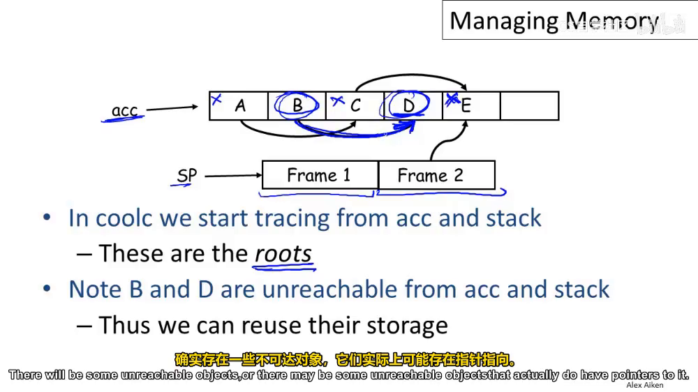
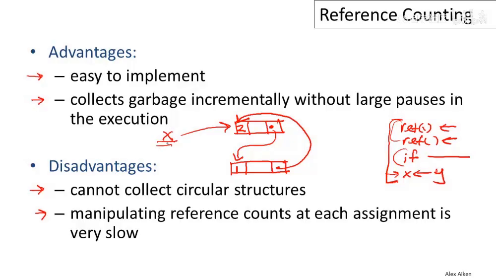

## 總結
Stanford CS143 Compiler 課程筆記系列第七篇

B 站連結：

[Lecture 17 - Automatic Memory Management](https://www.bilibili.com/video/BV1huRUYYEcw?spm_id_from=333.788.videopod.sections&vd_source=e0509e370f294390705899fe205d7d44&p=17) (1 hr)

重點
1. GC 依照 object reachability 來決定 object 是否為垃圾
2. 【方法一】Mark-and-sweep： 標記 reachability 清除其他。不移動 object（適用 C/C++），但造成記憶體碎片化
3. 【方法二】Stop-and-copy： 開很大的新空間，將 reachable object 「移動」到新空間。剩餘空間只剩垃圾，垃圾越多越有效率
4. 【方法三】Reference counting： 每個 object 記錄 reference count，歸零即回收。避免停頓好實作但速度慢，且無法處理 cycle graph


## GC（垃圾回收）介紹
當物件變成 unreachable 表示沒有任何指標指向它，必為垃圾，故其空間可回收

But 物件為 reachable 不代表它真的會被再用。例子：唯一指向它的 pointer 為 unreachable

```cpp
x = new A();
x = y;
// 空間 A 必為垃圾
```

有些語言例如 C/C++ 沒有 GC，會面對 memory leak/dangling pointer 等問題

### reachable 例子
任何 register（如圖中acc）以及 stack 內任何 pointer（指向E）可以遞迴指到的 objects 都是 reachable, 其餘是 unreachable

以下圖為例，ABCDE 是 new 出來的 heap memory, 其中 BD 是垃圾可以回收


## Mark and Sweep
1. 每個 object 會有一個 mark bit, 1 表示 reachable
2. 遞迴找出所有 unreachable object 標記成0，然後再依序檢查 heap memory 將他們全部清除

（可以用 pointer reversal 技巧維護一個 stack 實現 space O(1) 的圖dfs搜尋）

優點：object 不會被移動，適合在有指標的語言 C/C++（因為這些語言不允許你只移動object）

缺點：記憶體碎片化

## Stop and Copy
把 heap 分兩半：old space 與 new space
1. 把 old space 中 reachable objects 複製到 new space
2. 垃圾留在 old space
3. old/new space 交換

- Q: 複製 object 時必須修正指向它的指標。但怎麼得知指標？
- A: 在舊版本存一個 fordward pointer 導向新 object 並標記「已複製」，之後自動 forward

優點：配置時超簡單 `alloc ptr += size(obj)`；回收簡單（垃圾越多越有效率）

缺點：會移動物件，無法用於 C/C++ （暴露 pointer 的語言）

## Reference Counting
每個 object 記錄 reference count，到 0 就釋放掉。

無法處理循環結構
- pointer x 指向 object 2
- object 2 與 object 1 互指

當 x 不再指向 object 2 後，留下 cycle (object 1 ⇆ 2)；cycle 無法釋放


優點：避免長時間停頓；好實作

缺點：速度慢（每次 assign 都要更新 RC）、無法處理 cycles（須結合其他方法）

## 附錄 Conservative Collection
C/C++ 型別系統薄弱，怎麼知道一個值是 pointer 還是 data
1. 若 object 「看起來像指標」就當作指標處裡
2. 結果會多保留一些 unreachable object，但是安全
```
0x12345678 --> align 4 byte, 可能是 int*（位址必須是合法區段）
0x87878787 --> 一定不是 int* （假設工程師有避開 UB）
// 筆者補充: 不 align 4 byte 的 int* 是 Undefined behavior (C spec)
```
