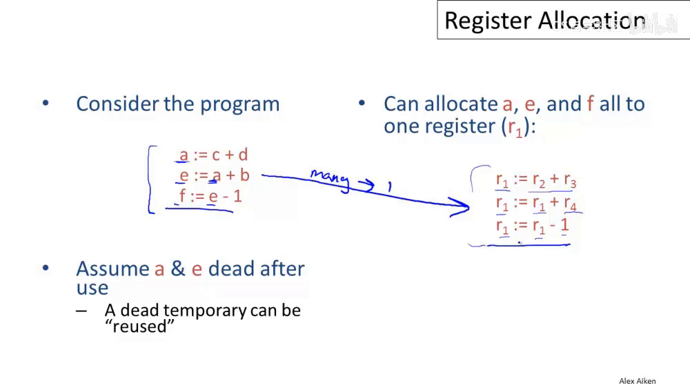
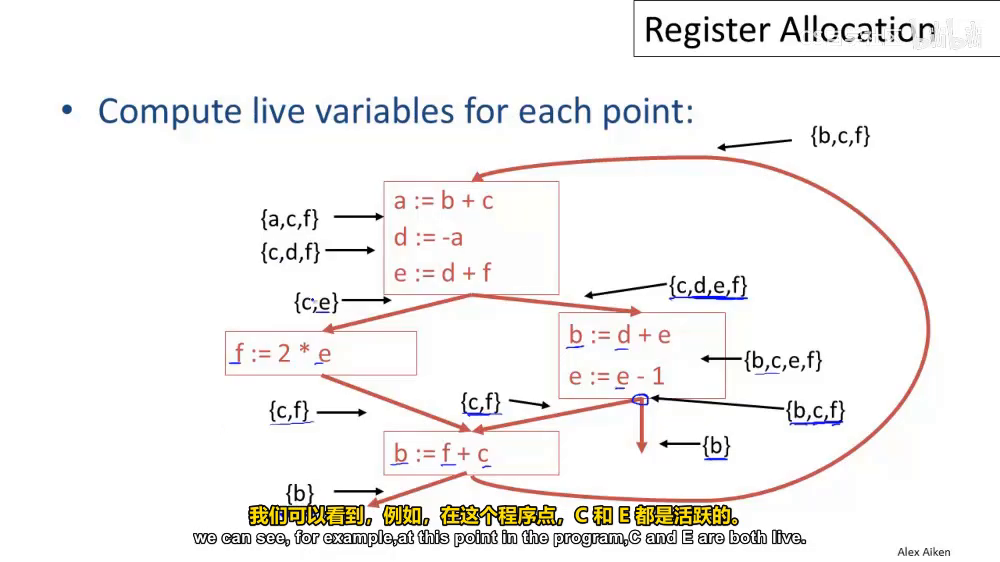
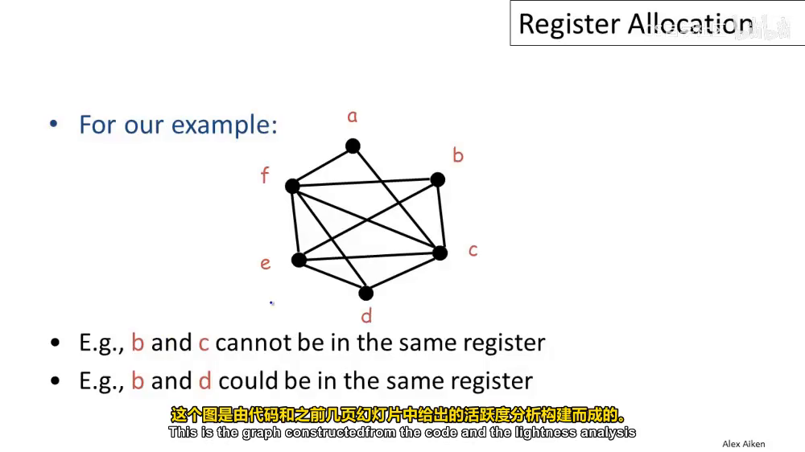
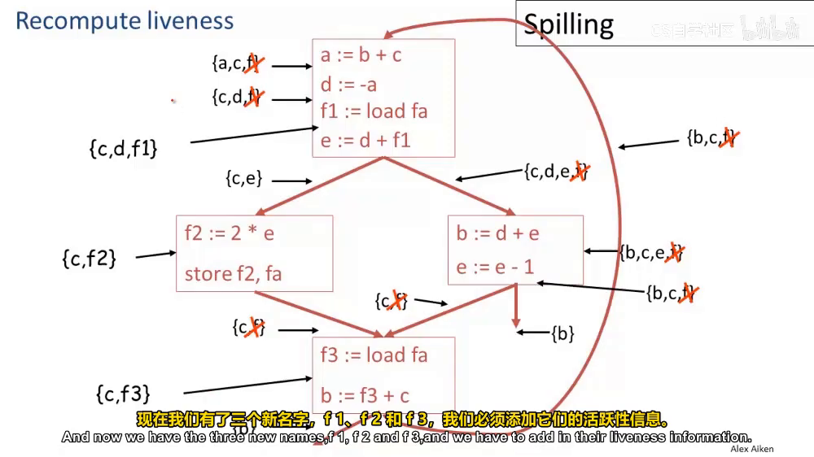
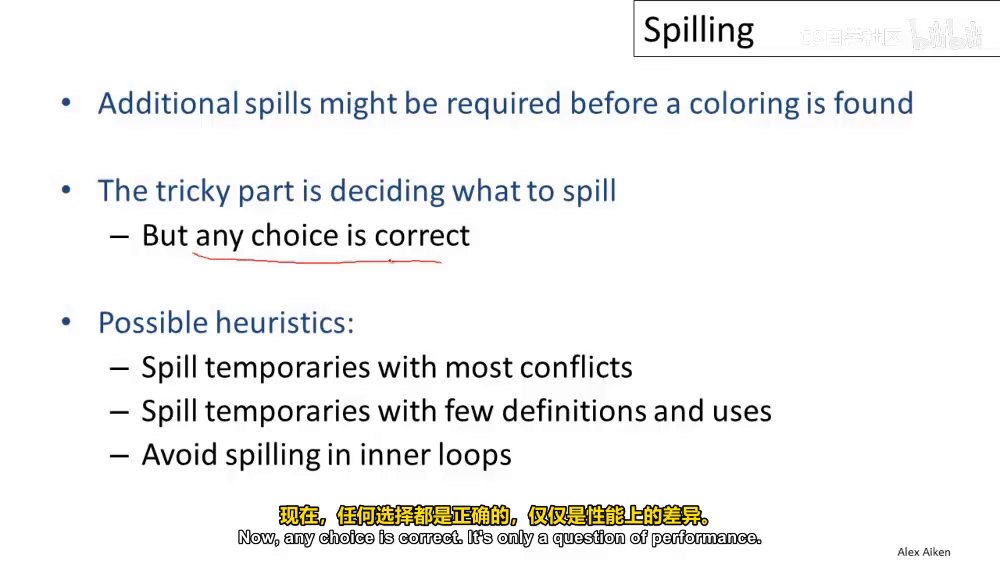
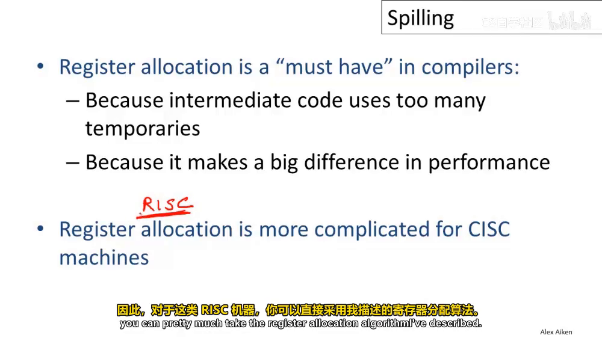

## 總結
本文是 Stanford CS143 Compiler 課程筆記系列第六篇

B 站連結：

[Lecture 16 - Register Allocation](https://www.bilibili.com/video/BV1huRUYYEcw/?spm_id_from=333.788.videopod.sections&vd_source=e0509e370f294390705899fe205d7d44&p=16) (50 min)

重點
1. Codegen 時，機器的 register 數量有限。NP-hard 問題，使用 Graph Coloring 演算法分配
2. Graph Coloring 求解失敗時嘗試 Spill
3. Spill 後可能有解。若無解則需要下放 temporary 變數到 memory
4. Compiler 不擅長做 cache 優化，請工程師寫 code 時自行留意


## 問題定義
IR 假設了無限多個 temporary, 但機器的 register 有限。因此需要改寫 IR，讓 temporary 不超過機器 register 數量。

**作法：把多個生命週期不重疊的 temporary 對應到同一個 register**


### RIG (Register Interference Graph)
給定一個 CFG，每個 temporary 是一個節點 (node)；若兩個 temporary 在程式某點同時 live，就在它們之間建立一條邊。

唯一需要知道的機器資訊是 register 數量




## Graph Coloring 演算法
1. 替每個節點上色，相鄰節點顏色互異
2. 能用 k 種顏色完成，就叫 k-colorable
3. 假設機器有 k 個 register，我們要求的就是 RIG 是否 k-colorable

**這是 NP-hard 問題，沒有已知的高效演算法**

**解題思路：**

**若節點 t 在 RIG 中鄰居數「小於 k」，將 t 移除後，剩下的 sub-graph 若是 k-colorable，則原圖也是——因為必定有顏色可以給 t。這是 divide-and-conquer**
1. 反覆挑選鄰居數 < k 的節點，放入 stack 並從圖中移除，直到圖為空
2. 依相反順序從 stack 彈出節點，逐一放回圖中並 assign register。因為移除時鄰居數 < k，加回時仍 < k，故必有顏色可用。

備註：即使某節點起初有超過 k 個鄰居，隨著其他節點被移除，其鄰居數最終可能會降到 < k，從而可被著色。


## Spilling
當所有節點鄰居數都 ≥ k 時，上述演算法會卡住，代表需要的 register 比機器擁有的還多
作法
1. 挑選一個節點從圖中溢出 (spill)，移除後其他節點鄰居數會降到 < k 得以繼續。著色子圖後，嘗試 optimistic coloring，有兩種可能性

Case 1： 有解，也許 node f 的鄰居剛好都用了同一個 register，仍有顏色可給 f

Case 2： 無解，node f 的鄰居用光了 k 個 register，需要把 f 存到 memory 中，讀取 f 之前插入 load, 寫入 f 之後插入 store

Case 2 效果就是把 f 拆成 f1/f2/f3 與 load store，讓 f 的 live range 縮小，重建的 RIG 中 f 的鄰居變少，原本無解的圖就變得有解



挑選策略(經驗法則)
- Edge 最多的 temporary (溢出後能移除最多 edge)
- 使用次數最少的 temporary (需要新增的 load/store 較少)
- 避免在 inner loop 內溢出 (多出 load/store 的代價高)，所有編譯器幾乎都會遵守



額外補充

此處的演算法針對 RISC 機器，可直接套用

CISC 機器對於 register 有更多限制 (某些運算只能用特定 register / 某些 register 只能存取特定型別)，需在 Graph Coloring 上加更多約束



## Managing Caches
編譯器在管理 register 上做的比工程師好，但「不擅長管理 cache」

一個編譯器能做的 cache 最佳化是 loop interchange (迴圈互換)

(筆者：或是像 row-major 與 column-major)

```cpp
// 假設 1000000 大到足以填滿所有 cache
// 爛，全是 cache miss
for (j = 1; j < 10; j++)
    for(i = 1; i < 1000000; i++)
        a[i] *= b[i];

// 讚，內迴圈有 cache hit
for(i = 1; i < 1000000; i++)
    for (j = 1; j < 10; j++)
        a[i] *= b[i];
```

互換後計算結果完全相同，但 cache 命中率大增，快十倍以上。

但是很少編譯器會實作，因為難以判斷是否能安全互換，所以要靠工程師自行察覺。