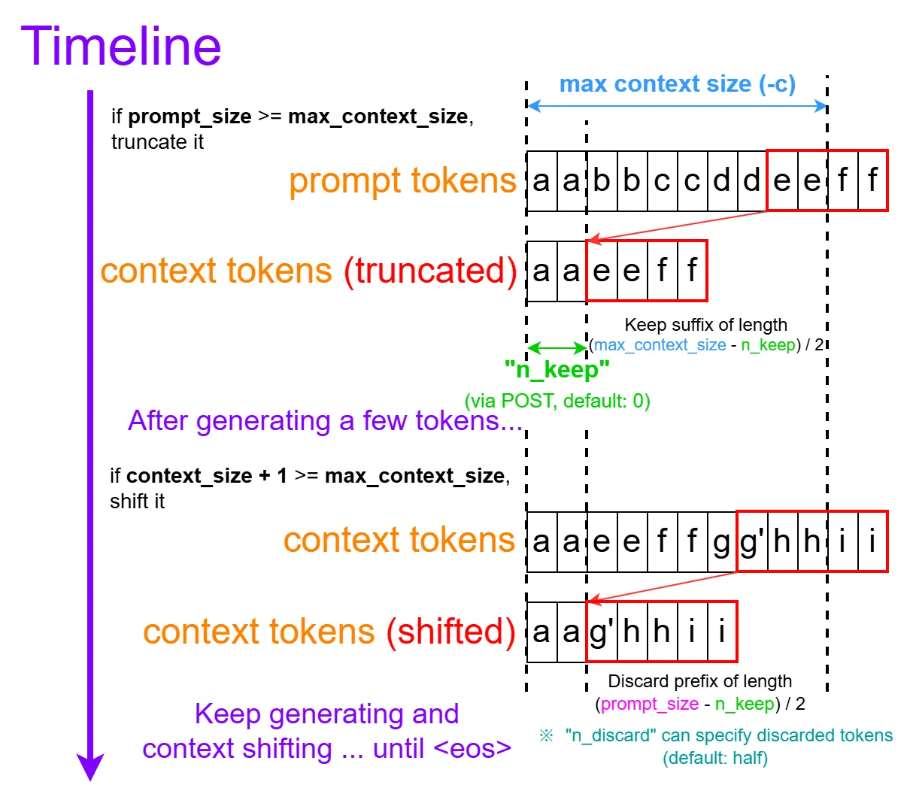
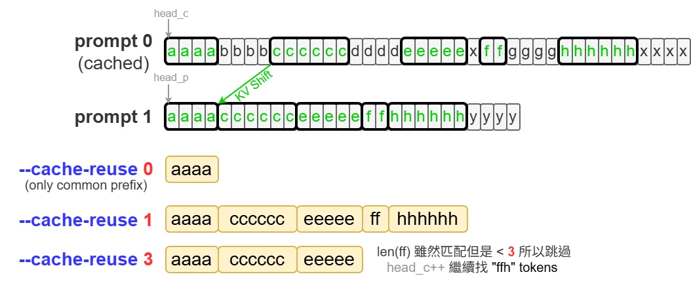

前陣子在研究 llama.cpp 框架支援的 KV Cache 操作，順手將一些常用或者有關 KV Cache 的參數記錄一下。預設值用粗體表示，隨時可能會變所以僅供參考。

## llama-server 參數
[https://github.com/ggml-org/llama.cpp/tree/master/tools/server](https://github.com/ggml-org/llama.cpp/tree/master/tools/server)

```
llama-server -m [模型.gguf] -np 1 -c 2048
```

- _-m [gguf模型]_
- _-np [N]_：Slots 數量（可同時處理的 requests）
- _-c [N]_：Context window size。預設 0 表示從模型 metadata 讀取

### KV 量化

- _-ctk [f32,_ **_f16_**_, bf16, q8_0, q4_0, q4_1, iq4_nl, q5_0, q5_1]_：Key cache 量化格式
- _-ctv [f32,_ **_f16_**_, bf16, q8_0, q4_0, q4_1, iq4_nl, q5_0, q5_1]_：Value cache 量化格式

### Offloading

- _-ngl [N|_**_auto_**_|all]_：放在 GPU 的模型層數。CPU + GPU 混合推論是 llama.cpp 的特色。auto是2025年底這個 [PR](https://github.com/ggml-org/llama.cpp/pull/16653) 新加的…
- **_-kvo_**_/-nkvo_：KV Cache 是否要 offload 到 GPU
- _--mlock_：把模型檔案 lock 在 RAM，避免被 OS swapping 到 disk
- **_--mmap_**_/--no-mmap_：是否 mmap 模型，預設開啟（[甚麼時候會想關掉？例如特定情況想減少 pageout 時](https://github.com/ggml-org/llama.cpp/discussions/1876)）
- _-ts [N0,N1,N2]_：模型 offload 到 GPU 的比例，例如雙 GPU 給 [3,1]

### Context Shift

> Prompt + generated tokens 超過 context window size 就不會報 error 了；反之會自動丟棄最前面的訊息



- _--context-shift/_**_--no-context-shift_** ([2025/08 預設變 disabled](https://github.com/ggml-org/llama.cpp/pull/15416))：解決長文問題；context 超過 window size 時會 truncate
- _-keep [N]_：位移時想保留的 initial prompt tokens 數量。預設 0。

> system prompt 通常不想被丟棄，這時就會用到 keep

### KV Shifting

> 讓 prompt 前綴不用完全一樣也可以複用 KV Cache（模型需要是 RoPE）



- _--cache-reuse [N]_：透過 KV Shifting 複用 KV 時的最小 chunk size。預設 0 表示不啟用

> Chunk size 太小有個缺點：復用的 KV Cache 意義上可能會不一樣

### Slots 相關

- _--slot-save-path [路徑]_：存放 KV Cache of slots 的位置

### 常見 KV Cache 優化 (預設都開啟)

- _-fa [on|off|_**_auto_**_]_：FlashAttention
- **_-cb_**_/-nocb_：Continous Batching
- **_--cache-prompt_**_/--no-cache-prompt_：啟用 Prompt caching（複用同 slot 上一筆 prompt 的 KV Cache）

--------------------

## Server API Endpoints

### POST /completion (not OAI-compatible)

```
curl --request POST \
     --url http://localhost:8080/completion \
     --header "Content-Type: application/json" \
     --data '{"prompt": "1+1=?", "n_predict": 128}'
```

```python
{
  "prompt": "1+1=?",
  "n_predict": 128,
  "top_k": 40,
  "grammar": "root::=[0-9]+",
  "cache_prompt": true
}
```

- _“cache_prompt”_：啟用 Prompt caching（複用同 slot 上一筆 prompt 的 KV Cache）。[預設打開](https://github.com/ggml-org/llama.cpp/pull/10501)
- _“id_slot”_：指定的 slot。預設 -1，Server 會選擇 idle slot 中相似度最高的 (common prefix/input tokens)

### KV slots 操作

- _POST /slots/{id_slot}?action=save_ (將 slot N 的 KV cache 寫到指定 filename)
- _POST /slots/{id_slot}?action=restore_ (將 filename 內的 KV cache 讀到 slot N)
- _POST /slots/{id_slot}?action=erase_ (刪掉 slot N 的 KV Cache)

### GET /slots

- 查看所有 slots 狀態