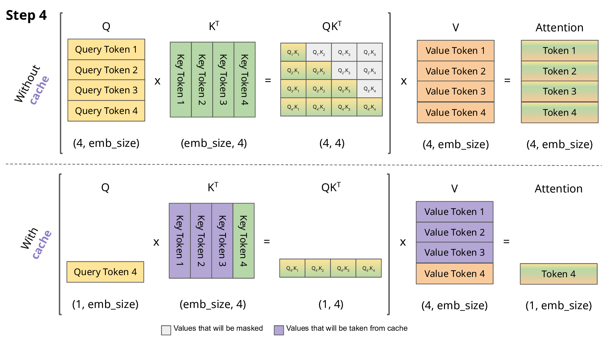
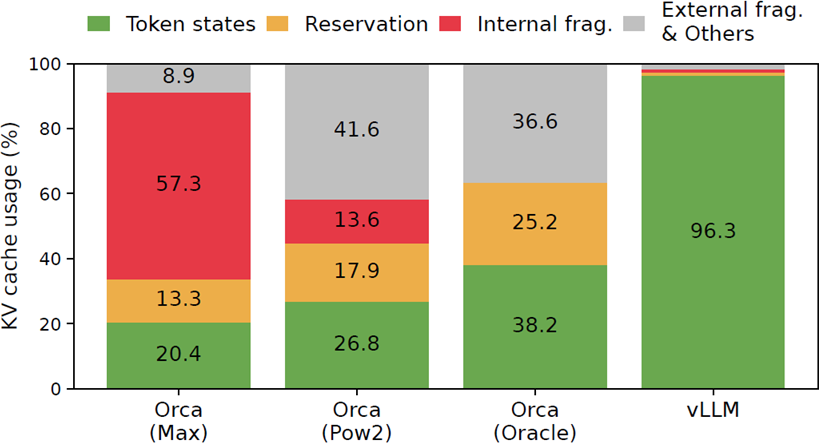
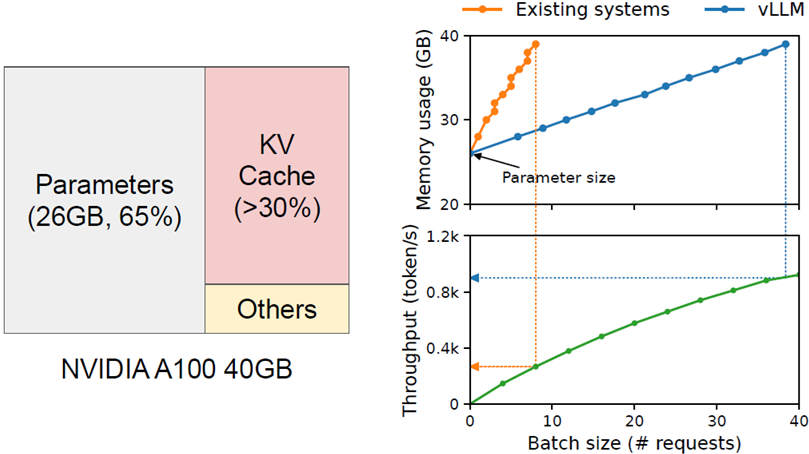
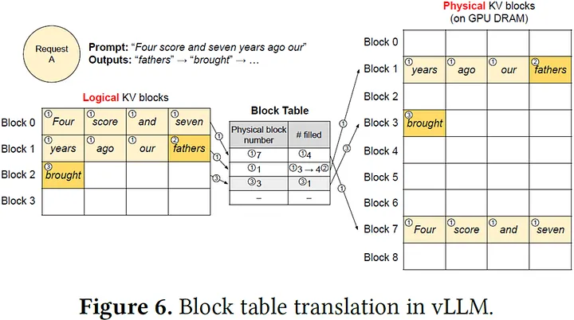
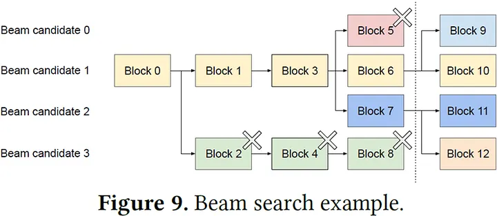
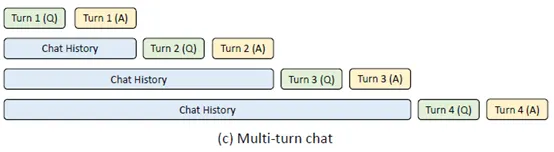
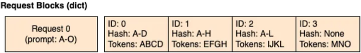

**論文重點**
- 提出了 PagedAttention 機制管理 KV Cache，大幅提升模型推論時的吞吐量

---

論文原文：[Efficient Memory Management for Large Language Model Serving with PagedAttention](https://arxiv.org/abs/2309.06180)

在大型語言模型（Large Language Models, LLM）爆炸式發展的這兩年，大家談論的焦點多半放在模型規模、能力與訓練資料上：參數越來越多、上下文長度越來越長、能做的任務也越來越多。然而，當這些模型真正走出論文、被放進產品裡，例如對話式助理、程式碼自動補全、雲端的文字生成 API，工程團隊很快會遇到另一個現實問題：**推論時 GPU 記憶體的不足，變成推論（Inference）階段真正的瓶頸**。

[vLLM](https://github.com/vllm-project/vllm) 是目前熱門的 AI 推論框架之一，專門針對高吞吐伺服器環境；最初由 UC Berkeley 開發，目前已成為 GitHub 上社群導向的開源專案，至截稿前有 64.9k 的星星與 11.8k 的 Fork，獲得高度關注與採用。

本文將會介紹 vLLM 創始團隊於 2023 發表的論文。其提出了受到作業系統虛擬記憶體啟發的設計：**PagedAttention**，解決 LLM 進行推論時，大量 KV Cache 於 GPU 記憶體（VRAM）碎片化而浪費的問題。在開始閱讀之前，建議先了解 Transformer 模型架構中的自注意力機制（self-attention）。

---

這邊簡單介紹一下 KV Cache 是什麼；在 Transformer Decoder 模型推論時會逐輪產生 token 與計算句子的 self-attention ，而 Attention 需要句子每個 token 的 Key & Value 向量；圖中上半部描繪了在沒有 Cache 的情況下， Transformer 計算整個句子 Attention 的過程



而 Key & Value 向量是由模型花時間 forward 計算得出的，我們可以把先前計算過的 Key & Value 向量 （上圖紫色部分）存在記憶體中，只需要計算新 token 的 Key & Value 即可，這樣推論時就可以省下很多時間，是目前 LLM 推論階段關鍵的加速技術。

---

模型推論時用到的記憶體為了講求快速，都會選擇放在 GPU VRAM上（這邊不考慮 Offloading 到 DRAM/SSD，因為很慢）。

回到論文，來看看在 vLLM 出現之前，推論系統 Orca （不公開，由論文作者實現）在 KV Cache 利用的表現如何



作者分別實現了三種 Orca 版本，分別是 Max（總是分配模型最大句子長度的記憶體）、Pow2（分配output句子長度兩倍的記憶體）、 Oracle（分配output句子剛好的記憶體）。可以看到不管是哪種，KV Cache 都會出現碎片化的問題導致記憶體浪費。來看看 GPU 記憶體有多珍貴？

論文中以一個 40 GB VRAM 的 NVIDIA A100 GPU 為例子，從下圖左半邊可以看到，目前 LLM 推論時的記憶體用量，模型參數占了65%，KV Cache 占了 >30%，剩下為保留給 activation 的空間。模型參數與 activation 是固定大小，因此可優化的部分就剩 KV Cache 了。



從上圖右下方綠線可以看到，Batch size 越大，單位時間內能處理的 requests 就越多，Throughput 就越高。在 40 GB 記憶體的限制下，可以看到藍線（vLLM）相較於橘線 （Orca/others），從 0.3k 提升到 0.9k，總共 3 倍的 Throughput 提升！由此可見避免 KV Cache 白白浪費記憶體有多重要。

因此作者用了作業系統管理虛擬記憶體的 Paging 技巧，將 KV Cache 分成 “Blocks” 來儲存，稱之為 **“PagedAttention”**。如下圖，每個 KV Block 包含了 4 個 Tokens （實際上預設是 16，論文 Ablation Study 章節指出 16 在大資料集與小資料集上都達到相對低的 latency），搭配 Block Table（映射表），一個 Logical KV Block 會對應到一個 Physical KV Block （如同虛擬記憶體以 Page 為單位對應到實體記憶體）



透過 PagedAttention 在分配 KV Cache 時就能以 Block 為單位分配，因為單位大小固定，可以簡單避免碎片化的問題，不再浪費 GPU 記憶體了！

從上圖還可以看到，如果不同 sequence 有著完全相同的 KV Block（左方 logical KV block #0 與右方 logical KV block #7），PagedAttention 可以映射到同一個 physical KV block #7，只需要存一份即可！


> **⚠️注意⚠️兩個 KV Blocks 前面整段 Tokens 要長度、內容完全一樣才算相同。**
>
> Why? 還記得 Transformer 論文提到的 Positional Encoding 嗎？Block 在句子中的絕對位置必須一樣；另外 KV Cache 存在於模型每一層，每層輸入是上一層經過 Attention 機制後的輸出。因此也會受前面 Tokens 影響。
>
> P.S. 目前普遍的 Encoding 方式是 RoPE


---

在許多場景下，相同前綴 tokens 的多個 sequences 會經常出現。論文中用 Beam search 舉例，如下圖，在搜尋（width=4）時，4 個 sequences 的前綴經常有部分重疊，產生大量相同的 Logical KV Blocks，vLLM 只需要存一份實體的，可以大大減少 GPU 記憶體用量！



---

除了 PagedAttention 架構，論文也針對 Request Scheduling 與 Preemption 兩個策略去說明，基本上目前 LLM 推論框架對這兩項都有參數可以調整

> Request Scheduling：多個 requests 同時正在排隊時，哪一個先做？
- 論文採用了 FCFS (First-Come, First-Served)，先抵達的先做
```html
vLLM 參數為 "--scheduling-policy"
```

> Preemption：當產生新 token 且發現 VRAM 不夠時，怎麼辦？
>
> 論文提出兩種方向：Swapping 與 Re-computation
- Swapping (offloading) 就是把暫時用不到的 sequence 的 KV Cache 放到比 VRAM 慢的 DRAM 上，等 VRAM 有空間時再搬回來（當 kv block size 設定較小時表現較差，因為 CPU/GPU 頻繁進行少量數據傳輸，使 PCIE 頻寬無法有效利用；反之較好）
- Re-computation 就是把暫時用不到的 sequence 的 KV Cache 扔了，之後再重新計算（因為一個完整句子的 KV 可以平行計算，在 GPU 算力無限的假設下，只需花費一次 prefilling 的時間）。
```html
vLLM V0 兩個方式都能用，參數為 "--preemption-mode"
vLLM V1 後只支援 Re-computation
```

---

以上是論文針對 KV Cache 提出的管理方式。此時 KV Cache 只是在一個 request 內複用。

論文發表時並未實現跨 requests 的 KV Cache 共享。如果新一輪的 request 能夠直接復用上一輪計算好的 KV Cache（例如多輪對話），就能夠大幅降低新一輪 request 的 TTFT，俗稱 Prefix Caching。Prefix Caching 在 SGLang 推論框架[論文](https://arxiv.org/abs/2312.07104)中提出，透過 RadixAttention 來實現。



在 SGLang 論文發表後，vLLM 也透過 Hash RadixAttention 實現了 Prefix Caching（[Issue #2614](https://github.com/vllm-project/vllm/issues/2614)），官方稱作 [Automatic Prefix Caching](https://docs.vllm.ai/en/latest/features/automatic_prefix_caching/)。**每個 KV Blocks 會以目前+前面所有的 Tokens 經過 Hash 後，用 Hash Key 來檢索；Hash Key 一樣才是相同的 KV Blocks**。有興趣的讀者可以看[官網詳細的說明](https://docs.vllm.ai/en/latest/design/prefix_caching/)。



---

以上就是 vLLM 論文的重點介紹了～

透過論文，我們可以學到 vLLM 最重要的 PagedAttention 架構，它是如何改善 KV Cache 記憶體分配的，這是未來 LLM 推論框架勢必要面對的一個課題。

vLLM 從 2023 六月的第一版，到 2024 三月實現了 Prefix Caching，再到 2025 今年陸續把整個架構從 V0 重新翻新變成 V1，程式碼上經歷了許多改變，也多了超多其他 LLM 加速推論的技術，變化很快。

在 vLLM 2023 推出後同年底，有另一個開源推論框架 [SGLang](https://github.com/sgl-project/sglang) 也登場了，使用了 RadixAttention（類似 trie）去管理 KV Cache。這兩個應該算是現在最熱門的 LLM 推論框架了，對最新大模型的支援速度也很快。

