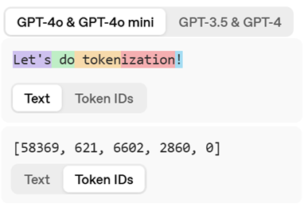
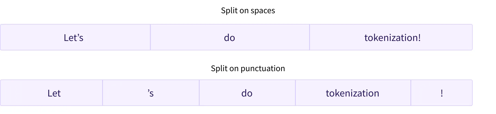
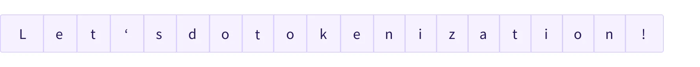

---

本文內容難度：★ ★ ☆ ☆ ☆

建議閱讀對象：想知道 Tokenizer 是如何建立詞彙表（vocabulary），以及如何將句子切割成 subwords 的人。

---

大型語言模型 (LLM) 在推論時的第一步為 Tokenization，Tokenizer 會將句子拆解成最小的語意單位（Tokens）。可以是一個單字（word）、一個字母（character）或一個子詞（subword）。來看看有哪些方式吧！

## Word-based
把句子中的每個單字（word）當成不同 token。使用空白字元與標點符號隔開即可達成。



- 優點：簡單
- 缺點：如果有 50 萬個英文單字，輸出的 dimension 就高達 50 萬導致參數過大；另外也無法處理不在詞彙表（Out of vocabulary, OOV）的單字

## Character-based
把句子中的每個字母（character）切割成不同 token。



- 優點：簡單、字彙量只要 26 個英文字母加特殊符號、不會有 OOV 的問題
- 缺點：token 太多導致序列太長，可能會超過上下文上限；單一字母代表的意義不足導致 tokenizer 很難訓練

---

上面兩種方法都有明顯的缺點，因此普遍不被使用。接下來要介紹的是目前常見的三種 Subword Tokenizer 方法，會分為**訓練階段**以及**切割階段**去說明

**訓練階段：** 指定 Vocabulary Size（例如希望最後有 100000 個 token），利用訓練資料 (corpus) 建立出 Vocabulary

**切割階段：** 將句子根據 Vocabulary 去切割成 tokens

> _Subword Tokenizer：結合 Word-based 機制只保留常見的單字避免參數過大，同時也保留了 Character-based 的機制，可以把單字拆成更小的單元。_
>
> _例如 “unfortunately” 可能被拆成 “un” + “fortunate” + “ly” 共 3 個 tokens。其中字首 un- 與字尾 -ly 都是常見且有意義的。_

<script src="https://gist.github.com/cayang0802/8fcdaf7e62a9005e7df1a0472499efca.js"></script>
<center>Subword Tokenizer 的比較</center>

BPE (Byte-Pair Encoding)
------------------------

### A. 訓練階段

> _反覆合併出現頻率最高的 pair 並加入詞彙裡。_

直接舉個例子～假設今天訓練資料來源如下：_“hug”_ 出現 10 次，_“pug”_ 出現 5 次 … 以此類推

```python
# 訓練資料 (Corpus)
("hug", 10), ("pug", 5), ("pun", 12), ("bun", 4), ("hugs", 5)
```

一開始先把出現過的字母都加進詞彙中

```python
Vocabulary = ["b", "g", "h", "n", "p", "s", "u"]
```

接著我們會計算詞彙中每個 pair 在訓練資料裡出現的頻率，並挑選頻率最高的合併並加入 vocabulary，並合併 corpus

```python
# 訓練資料 (Corpus)
("h" "u" "g", 10), ("p" "u" "g", 5), ("p" "u" "n", 12), ("b" "u" "n", 4), ("h" "u" "g" "s", 5)

# 每個 pair 的出現頻率 (由高到低排序)
("u", "g")  --> 20 次
("p", "u")  --> 17 次
("u", "n")  --> 16 次
("h", "u")  --> 15 次
...

# 將出現頻率最高的 ("ug") 加入 vocabulary，同時更新 corpus
Vocabulary = ["b", "g", "h", "n", "p", "s", "u", "ug"]
Corpus: ("h" "ug", 10), ("p" "ug", 5), ("p" "u" "n", 12), ("b" "u" "n", 4), ("h" "ug" "s", 5)
```

接著就反覆重複這個動作：計算每個 pair 的出現頻率 ➜ 挑選頻率最高的合併並加入 vocabulary 同時合併 corpus …

```python
# 訓練資料 (Corpus)
("h" "ug", 10), ("p" "ug", 5), ("p" "u" "n", 12), ("b" "u" "n", 4), ("h" "ug" "s", 5)

# 出現頻率 (由高到低排序)
("u", "n")  --> 16 次
("h", "ug") --> 15 次
("p", "u")  --> 12 次
("p", "ug") -->  5 次
...

# 將出現頻率最高的 "un" 加入 vocabulary，同時更新 corpus
Vocabulary = ["b", "g", "h", "n", "p", "s", "u", "ug", "un"]
Corpus: ("h" "ug", 10), ("p" "ug", 5), ("p" "un", 12), ("b" "un", 4), ("h" "ug" "s", 5)
```

直到 vocabulary size 達到我們設定的目標 (10) 就停止，這就是我們目前 Tokenizer 所有的詞彙了

```python
# 這是最終結果 (假設設定的目標為 vocabulary size = 10)
Vocabulary = ["b", "g", "h", "n", "p", "s", "u", "ug", "un", "hug"]
```

到目前為止 Tokenizer 已經訓練好 vocabulary了，現在來看看它是怎麼將句子切割成 subwords

### B. 切割階段

我們現在給一個句子 `"bugs"` ， BPE 用剛剛建立的詞彙表與合併規則去切割 tokens，最後得到結果 `["b", "ug", "s"]` ，步驟如下：

```python
"""
筆者備註：在這個例子中沒有特別去處理 out of vocabulary 的問題；
        不過實際應用上不會有 OOV 的問題 (因為訓練資料一定會出現 a-z 與所有符號)
"""

# 剛剛建立的詞彙表
Vocabulary = ["b", "g", "h", "n", "p", "s", "u", "ug", "un", "hug"]

# 訓練階段建立的合併規則 (按照產生的先後順序)
1. (u, g) -> ug
2. (u, n) -> un
3. (h, ug) -> hug

# -------------------------------------------- #
# 給一個輸入句子 s = "bugs"
# 一開始先拆成最小單位 ["b", "u", "g", "s"]
s.tokens = ["b", "u", "g", "s"]

# 根據上面的合併規則(1~3)順序，依序檢查是否有出現在句子裡
# 1. 檢查規則1 (u,g)  --> 中間有出現，合併它們！
s.tokens = ["b", "ug", "s"]
# 2. 檢查規則2 (u,n)  --> 沒出現，跳過
# 3. 檢查規則3 (h,ug) --> 沒出現，跳過

最後得到結果 ["b", "ug", "s"]
```

在實務上，BPE 會使用 `Ġ` 表示單字前面的空格。例如 `"Hello world"` 在最一開始會被解析成兩個單字 `(Hello, Ġworld)` ，目的是為了讓 Tokenizer 能夠「看見」空格，以及具有可逆性：如果沒有 `Ġ` 來標記空格，當你把 Token 轉換回文字時，會不知道哪裡該加空格。

WordPiece
---------

### A. 訓練階段

由 Google 發明，用在 BERT 系列模型上。

使用 `##`來代表該 subword 是前面一個 subword 的**延續**，它們在原始文本中是連在一起的。例如 “word” 一開始會被切成 `w ##o ##r ##d` ；`("play", "##ing")` 在原始文本表示單字 `playing`，具有可逆性。

跟 BPE 一樣，WordPiece 學習合併規則。

> _跟 BPE 的差別差在 WordPiece 不是選擇最頻繁的 pair 去合併，而是使用以下公式計算 pair 的分數_

```python
# 假設 pair 為 "hap","py"

# 分數 = "happy"出現頻率 / ("hap"出現頻率 × "py"出現頻率)
score = (freq_of_pair) / (freq_of_first_element × freq_of_second_element)
```

該算法優先合併單個部分在詞彙表中頻率較低的 pair。例如，它不一定會合併 `("un", "##able")` 即使它在詞彙表中出現的頻率很高，因為 `"un"` 和 `"##able"` 很可能頻繁地出現在其他詞中。

接下來我們以前面 BPE 舉的相同例子進行示範

```python
# 訓練資料 (Corpus)
("hug", 10), ("pug", 5), ("pun", 12), ("bun", 4), ("hugs", 5)
```

一樣先把出現過的字母都加進詞彙中

```python
Vocabulary = ["b", "h", "p", "##g", "##n", "##s", "##u"]
```

接著利用上面的公式計算每個 pair 的分數，並挑選分數最高的合併並加入 vocabulary，並合併 corpus

```python
# 訓練資料 (Corpus)
("h" "##u" "##g", 10), ("p" "##u" "##g", 5), ("p" "##u" "##n", 12), ("b" "##u" "##n", 4), ("h" "##u" "##g" "##s", 5)

# 每個 pair 的分數 (由高到低排序)
("##g", "##s")  -->  5 次 / (20×5)  = 1/20
("h", "##u")    --> 15 次 / (15×36) = 1/36
("##u", "##g")  --> 20 次 / (36×20) = 1/36
...

# 將分數最高的 "##gs" 加入 vocabulary，同時更新 corpus
Vocabulary = ["b", "h", "p", "##g", "##n", "##s", "##u", "##gs"]
Corpus: ("h" "##u" "##g", 10), ("p" "##u" "##g", 5), ("p" "##u" "##n", 12), ("b" "##u" "##n", 4), ("h" "##u" "##gs", 5)
```

接著就反覆重複這個動作：計算每個 pair 的分數 ➜ 挑選分數最高的合併並加入 vocabulary 同時合併 corpus …

```python
# 訓練資料 (Corpus)
("h" "##u" "##g", 10), ("p" "##u" "##g", 5), ("p" "##u" "##n", 12), ("b" "##u" "##n", 4), ("h" "##u" "##gs", 5)

# 每個 pair 的分數 (由高到低排序)
("h", "##u")    --> 15 次 / (15×36) = 1/36
("##u", "##g")  --> 20 次 / (36×20) = 1/36
...

# 將分數最高的 "hu" 加入 vocabulary，同時更新 corpus
Vocabulary = ["b", "h", "p", "##g", "##n", "##s", "##u", "##gs", "hu"]
Corpus: ("hu" "##g", 10), ("p" "##u" "##g", 5), ("p" "##u" "##n", 12), ("b" "##u" "##n", 4), ("hu" "##gs", 5)
```

直到 vocabulary size 達到我們設定的目標 (10) 就停止，這就是我們目前 Tokenizer 所有的詞彙了

```python
# 下一輪 pair 的分數 (由高到低排序)，因此第三輪將加入 "hugs"
("hu", "##gs")  -->  5 次 / (15×5)  = 1/15
("p", "##u")    --> 17 次 / (17×21) = 1/21
...

# 這是最終結果 (假設設定的目標為 vocabulary size = 10)
Vocabulary = ["b", "h", "p", "##g", "##n", "##s", "##u", "##gs", "hu", "hugs"]
```

### B. 切割階段

現在來看看 WordPiece 是怎麼將句子切割成 subwords。前面提到的 BPE 在 tokenization 過程會根據學習到的合併規則去合併，但是 WordPiece 不是！

> _WordPiece 從句子開頭開始，找到 vocabulary 中與句子前綴相同且最長的 subword 然後拆分，反覆直到句尾。_

一樣舉相同句子 `"bugs"`， vocabulary 中 `b`開頭只有它自己，所以得到 `["b", "##ugs"]`。(如果 vocabulary 有`"##bu"`則得到的結果不同)

接著看`"##ugs"`，`"##u"` 是 vocabulary 中與 `"##ugs"` 前綴相同且最長的subword，所以拆分並得到 `["b", "##u", "##gs"]` 。最後，`"##gs"` 在 vocabulary 中所以不拆，最後結果為 `["b", "##u", "##gs"]` 。

Unigram
-------

### A. 訓練階段

跟 BPE 和 WordPiece 不同，Unigram 從一個較大的 vocabulary 開始，然後從中刪除 tokens，直到達到所需的 vocabulary size。

直接使用先前的範例

```python
# 訓練資料 (Corpus)
("hug", 10), ("pug", 5), ("pun", 12), ("bun", 4), ("hugs", 5)
```

我們先列出所有的 substrings 並加入 vocabulary。為了簡化問題所以只保留 strict substrings

```python
# 為了簡化問題，只保留 strict substrings
# 排除以下 strings ("hug" 不排除因為它是 "hugs" 的 strict substring)
# 'pug', 'pun', 'ugs', 'hugs'

Vocabulary = ["h","u","g","hu","ug","p","pu","n","un","b","bu","s",
              "hug","gs","ugs"]

# 順便算出它們的出現頻率，出現頻率的總和是 210
# "p" 出現頻率是 17 所以出現機率是 17/210
("h", 15) ("u", 36) ("g", 20) ("hu", 15) ("ug", 20) ("p", 17) ("pu", 17) ("n", 16)
("un", 16) ("b", 4) ("bu", 4) ("s", 5) ("hug", 15) ("gs", 5) ("ugs", 5)
```

我們先來為 corpus 的每個 word 定義它的「分數」。我們會對 word 列舉所有的分割方式，並選出其中最高的機率乘積當作「分數」，以 `"pug"` 舉例

```python
# "pug" 可以切割成三種方式，以下是每種方式的分數
# 「分數」為每個 subword 出現機率的乘積
["p", "u", "g"] : (17/210)×(36/210)×(20/210) = 0.001321  (score)
["p", "ug"]     : (17/210)×(20/210)          = 0.007710  (score)
["pu", "g"]     : (17/210)×(20/210)          = 0.007710  (score)

# 我們挑分數最高的
```

我們得到 `"pug"` 的「分數」是 0.007709，且我們會傾向將它拆成 `("p", "ug")`或`("pu", "g")`而不是 `("p", "u", "g")` 。這是每個 word 的分數與拆法：

```python
"hug": ["hug"] (score 0.071428)
"pug": ["pu", "g"] (score 0.007710)
"pun": ["pu", "n"] (score 0.006168)
"bun": ["bu", "n"] (score 0.001451)
"hugs": ["hug", "s"] (score 0.001701)
```

回到目前例子

```python
# 訓練資料 (Corpus)
("hug", 10), ("pug", 5), ("pun", 12), ("bun", 4), ("hugs", 5)
```

> _現在要來決定我們要從 vocabulary 中踢掉哪一個 token，我們會檢查**刪除哪個 token 會讓所有 word 的 Loss (NLL, negative log likelihood) 增加最少**_

Loss Function (NLL) 為每個 word 的 `出現頻率 * -log(該word分數)` 的總和，值為 169.8

```
10 * (-log(0.071428)) + 5 * (-log(0.007710)) + 12 * (-log(0.006168)) + 4 * (-log(0.001451)) + 5 * (-log(0.001701)) = 169.8
```


假設我們踢掉 `"pu"` ，那 `"pug"` 仍然可以拆成 `("p", "ug")`並維持相同的分數 (0.7710)。因此踢掉`"pu"`將給出完全相同的 Loss

但如果我們選擇踢掉`"hug"` ，那麼 Loss 會增加很多，因為 `"hug"` 和 `"hugs"` 的標記化會變成：

```python
"hug": ["hu", "g"] (score 0.006802)
"hugs": ["hu", "gs"] (score 0.001701)
```

這些變化將導致 Loss 上升 23.5

```python
# "hug" 增加的Loss
- 10 * (-log(0.071428)) + 10 * (-log(0.006802)) = 23.5

# "hugs" 則沒有增加Loss，因為 ["hug", "s"] 與 ["hu", "gs"] 的 score 都是 0.001701
```

因此我們選擇踢掉 `"pu"` 而不是 `"hug"`

> _Unigram 希望減少 vocabulary 中相似冗餘的 token，確保詞表裡的每一個 token 都是不可或缺的，不希望有「換了別人也能拼出來，且效果差不多」的 Token 存在（在本例`"pu"`與其它 token 功能太接近，不需要它）_

接著就重複上面流程，反覆挑選 token 踢掉，直到 vocabulary size 達到我們設定的目標就可以停止啦～

### B. 切割階段

Unigram 在切割句子中的 word 時，會使用 Viterbi 演算法，以 NLL 最低的方式去切割，有興趣的讀者可以再深入研究

以上就是 BPE, WordPiece, Unigram 三種演算法的介紹了，希望對大家有幫助～

## 參考資料

[Hugging Face LLM Course — chapter 6 (the tokenizers)](https://huggingface.co/learn/llm-course/chapter6/1)


